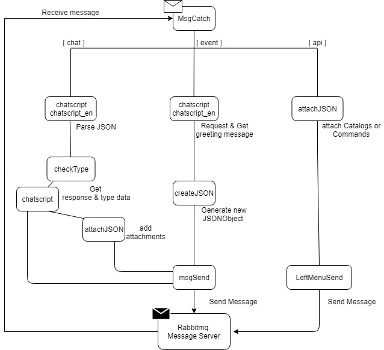

# CS_Bridge

KR/ENG Ver. ChatScript file is here : [ChatScript KR/ENG Version with Wrapsody](https://taehoonHoodyKim@bitbucket.org/taehoonHoodyKim/csbridge.git)


# Structure
1. Receive data from the Rabbitmq message server.
2. Checkout User's locale & type of the languge what user entered on the chatting application.
3. Bring user's input into the ChatScript Server.
4. Get a response from ChatScript Server and modify it by the rule.
5. Send back to the Rabbitmq Server.

# Features
* Use Korean POS-Tagger : [open-korean-text](https://github.com/open-korean-text/open-korean-text)  


# Script Rule Guide
The name of the file in this project is "WrapsodyUserGuide.top" 
  
Here is the simple example of the Script.
```
u: (hello)  
Nice to meet you!\n  
type: 7 reportNum: 0 attachFlag: 0 fileName: 00.jpg\n  
```

* Every Single line have to contain '\n' at the end of the line except the matching line.
* mathcing line -> u: (hello)
* The last sentence would be end with "Tag parts".
* Tag Form:[Type: (0-7)  reportNum: (0-2) attachFlag: 0 fileName: name.jpg]

* Type: each number shows how they will be modified.
```
  - 0:file, 1:image, 2:video, 3:Sound, 4: scrap, 5:button
  - 6: just return response of the ChatScript ( with additional question)
  - 7: just return response of the ChatScript ( without additional question)
  ```
 
* reportNum: when send the email to the admin 
 ```
  - 0: do not send the email.
  - 1: send email about "feature_suggestion"
  - 2: send email about "error_submission"
  ```
  
 * attachFlag: Unused currently
 
 * fileName: enter the name of the files to attach them. 
 ```
  - When attach more than one files, seperate them by the white space ' '
  - Just enter dummy file name when the typeNum is 5, 6, or 7
 ```
 
 # Writing Concept
 Concept is the group of the words  
 example)  
 ```
 concept: ~food ( ~burger ~pizza ~noodle )
 concept: ~burger ( bigMac "cheese burger" McDouble)
 concept: ~pizza ( "Meat Lovers pizza" "Peperoni pizza")
 concept: ~noodle ( pho pasta ramen )
 ```
 ```
 u:(~food)
 I love that too
 
 ```
 
 Burger, Pizza, and Noodle shows the list of their menus.  
 These three concepts are the part of the food concept.  
 Therefore, the above script will print out "I love that too" when user input the "pasta"
 
 # Flow
 
 
